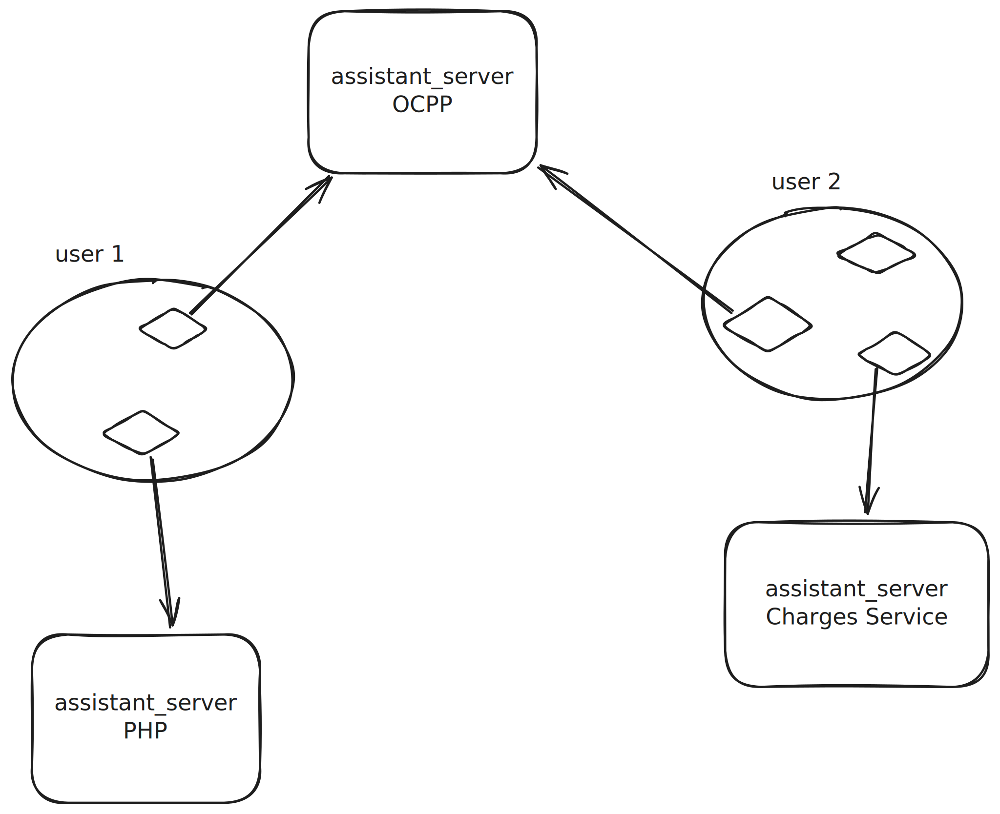

# ai-chat

A chat application with support for OpenAI models and custom server assistants.

## Features

- Chat with OpenAI's latest models
- Generate images with DALL-E
- Support for custom server assistants with contextual data
- Message starring for important information
- Export and import conversations
- Conversation search and management
- PWA support for offline access

## Server Assistant API

You can add your own assistant using the server assistant API. This allows you to:

1. Connect to your own assistant server with custom knowledge
2. Use your server's system prompt for conversations
3. Enhance conversations with contextual data from your server 

### Setup

To connect a server assistant:
1. Create a new conversation and select "Server Assistant"
2. Enter your server URL and authentication token
3. The system prompt will be loaded from your server

### How it works

When you chat with a server assistant:
- The app fetches the system prompt from your server's `/config` endpoint
- Your messages are embedded and sent to the server's `/search` endpoint
- Relevant context from your server is added to OpenAI requests
- Your conversation history remains private and doesn't include the assistant's context

## Additional Documentation

- [Assistant Server Implementation](assistant_server/README.md)
- [Assistant Server Setup Guide](assistant_server/SETUP.md)
- [JSON Server with Redis](json_server/README.md)
